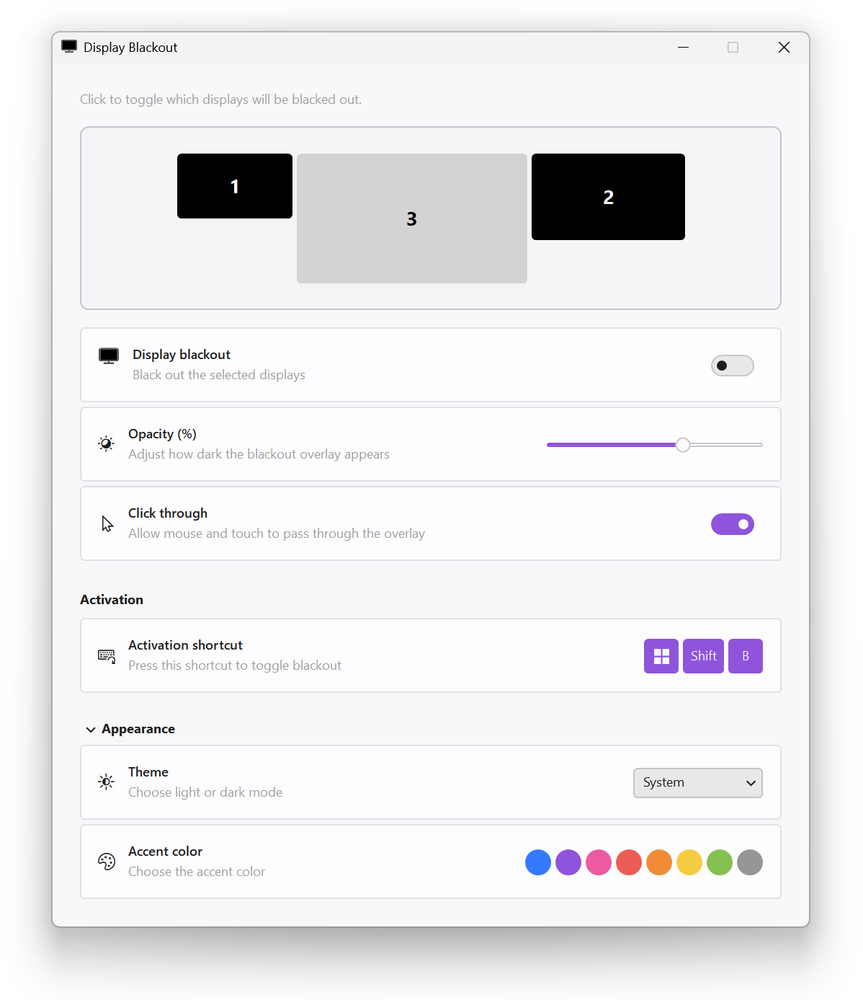
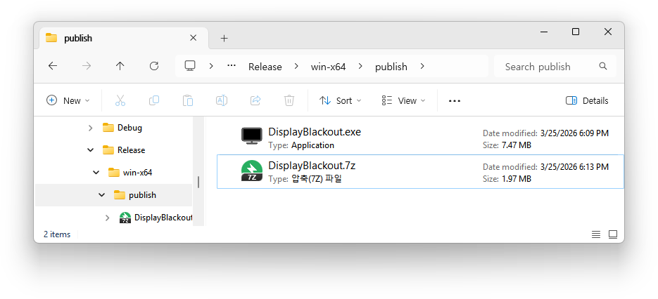

# DisplayBlackout.MewUI

A **MewUI port** of the original **[Display Blackout](https://github.com/domenic/display-blackout)** project.

A Windows system tray utility that blacks out selected displays on demand. Useful for reducing distractions while gaming, focusing on a single monitor, or dimming secondary displays during video calls.

The original project's README raises practical concerns about shipping a small native Windows utility — runtime bundling and external runtime dependencies that persist even after NativeAOT. This port explores **what answers MewUI can offer to those same questions**.


> [!NOTE]
> This is an experimental port for MewUI framework validation. It is **not intended to replace the original project**.






## Features

- **Selective blackout**: Choose which displays to black out via a visual monitor picker
- **Adjustable opacity**: Control how dark the blackout overlay is
- **Click-through mode**: Interact with blacked-out displays without disabling blackout
- **Global hotkey**: Toggle blackout with Win+Shift+B
- **System tray integration**: Quick access from the notification area
- **Theme & accent customization**: Light/Dark/System theme with multiple accent colors

## Build

```bash
dotnet build
```

Run:

```bash
dotnet run
```

## Requirements

- .NET 10 SDK
- Windows 7 or later

## Privacy and Security

This app requires no administrator elevation, makes no network requests, and collects no telemetry or user data. Settings are stored locally in a JSON file under `%LocalAppData%/DisplayBlackout/`.

## Why MewUI?

The original author noted that WinUI 3 supports NativeAOT, which bundles the .NET runtime into the binary. However, **the WinAppSDK runtime itself still requires separate installation** on the user's machine — the AOT story is only half-complete.

MewUI removes this layer entirely. There is no WinAppSDK dependency and no external runtime requirement.

## Attribution

This project is based on:

- **[Display Blackout](https://github.com/domenic/display-blackout)** by Domenic Denicola
